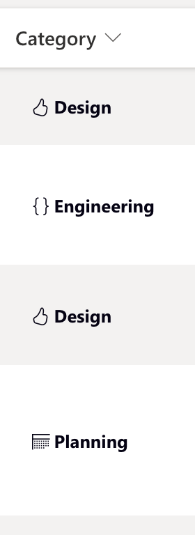
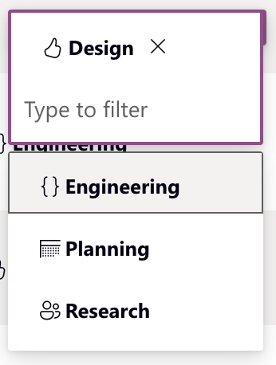

# Category

## Usage(s)

Set what category of work the task falls under.

- Design
- Engineering
- Planning
- Research

## Icons

## Interactions

- Inline edit

## Examples

The below example is what the column should look like when interacting inside of a table/grid view.

| Column 1      | Column 2      |
| ------------- | ------------- |
|  |  |
