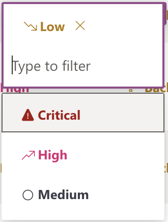

# Priority

## Usage(s)

Setting a priority for a given task.

- Low
- Medium
- High
- Critical

## Icons

None

## Interactions

- Inline edit

## Examples

The below example is what the column should look like when interacting inside of a table/grid view.

