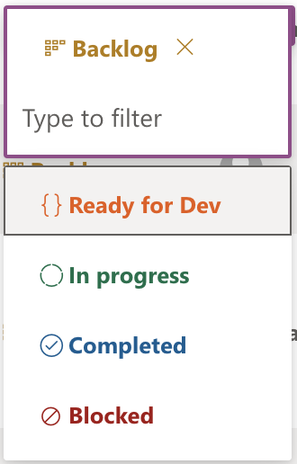

# Status

## Usage(s)

Set the status for a given task. In this case, status was used to determine where in the work process the task was.

- Backlog
- Ready for Dev
- In progress
- Completed
- Blocked

## Icons

- (Backlog)
- (Ready for Dev)
- (In progress)
- (Completed)
- (Blocked)

## Interactions

- Inline edit using dropdown menu

## Examples

The below example is what the column should look like when interacting inside of a table/grid view.

