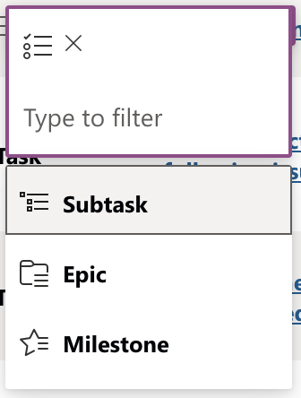

# Task Type

## Usage(s)

Setting a priority for a given task.

- Epic
- Milestone
- Task
- Subtask

## Icons

- (Epic)
- (Milestone)
- (Task)
- (Subtask)

## Interactions

- Inline edit using dropdown menu

