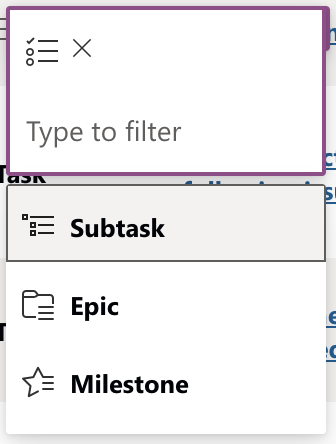

# Task Type

## Usage(s)

Use this column to identify the type of task that the given item falls under.

- Epic
- Milestone
- Task
- Subtask

## Icons

- (Epic)
- (Milestone)
- (Task)
- (Subtask)

## Interactions

- Inline edit using dropdown menu

## Examples

The below example is what the column should look like when interacting inside of a table/grid view.

