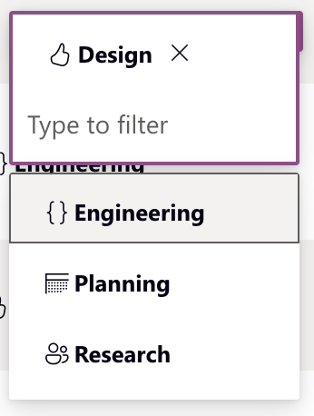

# Example

## Usage(s)

> Describe what this column is used for.
>Include any selection choices, if applicable. If this is a free-form entry field, this section can be deleted.

``` json
- Epic
- Milestone
- Task
- Subtask
```

## Icons

> Add any icons that you will be using to communicate with your user. If none, you may delete this section.
> Icons are from Fluent 2

``` json
- (Epic)
- (Milestone)
- (Task)
- (Subtask)
```

## Interactions

> If you have any specific interactions (such as inline edit in a table or grid) add that here.

- Inline edit using dropdown menu

## Examples

> Should you want to add examples images, include them here.

### Markdown

>``

### HTML (for specifying height/width)

>``

#### Multiple images?

If you have multiple images to show, it is recommended that you add them to a table in order to keep them organized and on the same line. Images in a table can only utilize Markdown image rendering.

| Column 1      | Column 2      |
| ------------- | ------------- |
|  |  |
|  |  |
